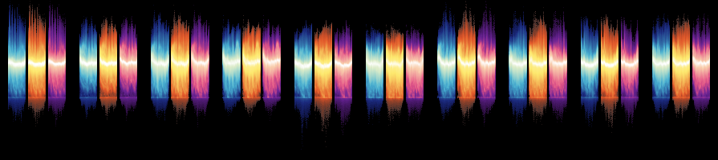

# Visualizing-3-Billion-Points
Using Dask and Datashader to Visualize a 150 gigabyte, 3 Billion Point Dataset, on a laptop!

[launch the ipython notebook](https://www.google.com)

---

**Goal:**

-To visualize as 150 gigabyte data set consisting of 3 billion points on a 2D access showing 3 different scenarios of 1 billion estimates each.

---

**Primary Tools**

Dask and Datashader

---

**Result**

---

**Summary**

The result was a semi-success. I was able to get 3 billion rendered points on a single figure with the histogram equallization transfer function included in datashader. It is cool looking, though its usefullness can be argued. Later in this analysis I will use more of what dask and datashader have to offer, probably on a bigger machine or cluster, and really get into some deeper analysis. I did not not include any example data as of yet, but I though this might be useful to those of you trying to solve similar problems, check out the process by launching the ipython notebook: 

[launch the ipython notebook](https://www.google.com)

---
